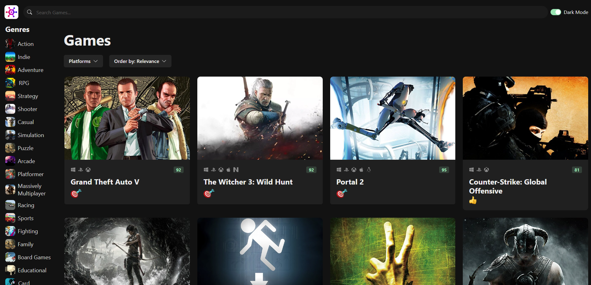

 

<h3 align="center">Game Hub</h3>

  

Game Hub is a dynamic and visually appealing game hub created using the RAWG Video Games Database API. This project serves as a comprehensive platform for gamers to explore, discover, and keep track of their favorite games. The design is inspired by the sleek and user-friendly interface of RAWG, providing a seamless and immersive experience for users
     
     
     
    <a href="https://chrissv2.github.io/GameHub/">View Demo</a>
  

## About The Project

I recently crafted a Game Hub using the RAWG API and React, and it's been a game-changer for my skills. Navigating React's intricacies, I've not only built a sleek hub for gaming enthusiasts but also gained a ton of confidence. This project was a confidence booster, affirming my grasp of React's nuances and giving me hands-on experience that's invaluable. Here's to coding, learning, and leveling up! 🚀🎮

### Built With

  
  
  
  

